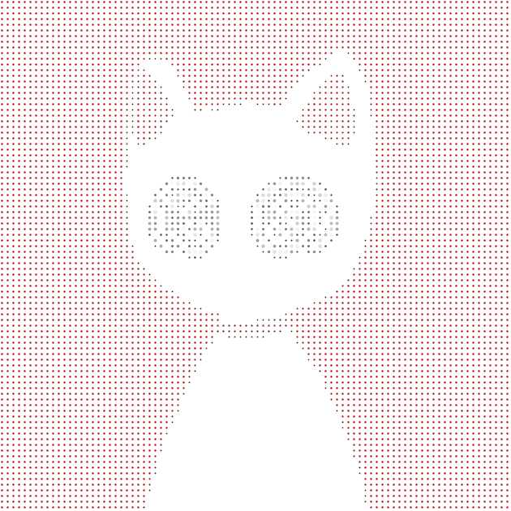

<a name="top"></a>
<div align="center">

<!-- PORTRAIT - generated by scripts/dotify.py from avatar.png (GitHub profile picture) -->


<br>
<br>

<!-- NAME - animated typing -->
<a href="https://github.com/SpitFiyah">
  
</a>

<br>
<br>

<!-- SOCIALS -->
<a href="https://github.com/SpitFiyah"></a>
<a href="https://linkedin.com/in/"></a>

<br>
<br>


</div>

---

## `~/` whoami

```console
$ cat about.txt
```

Hi, I'm **Afnan Tariq**! I'm a Computer Science Engineering student. I'm interested in Cybersecurity and Low level systems prrogramming (Operating Systems, NNetworking, Windows/Linux Internals).

---

## `~/` stack

<div align="center">
  <a href="https://skillicons.dev">
    
  </a>
</div>

```
  Languages   C, Python, Bash, Shell, Java
  Systems     Linux/Windows Internals, Operating Systems
  Domain      Cybersecurity, Offensive Security, Networking (TCP/IP, DNS), Low-Level Programming
  Tools       Git, GitHub, VS Code, Linux Shell, Network & Packet Analysis
```

---

## `~/` interests

- **Cybersecurity** — Offensive security, reconnaissance, OSINT, vulnerability research, and security tooling.
- **Networking** — DNS, TCP/IP, packet analysis, network discovery, protocol behaviour, and network mapping.
- **Systems** — Operating systems, Windows/Linux internals, and low-level behaviour.
- **Low-Level Programming** — C, memory, pointers, processes, system interfaces, and understanding machine-level execution.
---

## `~/` selected work

| Project | What it is |
| --- | --- |
| **[Research-port53-dnsmasq](https://github.com/SpitFiyah/Research-port53-dnsmasq)** | Hands-on research into an Android hotspot exposing `dnsmasq 2.51` on port 53, including DNS behaviour, historical vulnerabilities, malformed packet handling, recursion, cache behaviour, and IPv6 exposure. |
| **[AttackLens](https://github.com/SpitFiyah/AttackLens)** | *(In development)* Network & system security analysis tool. |

---

## `~/` stats & skill radar

<div align="center">
  
  
  <br><br>
  
  
</div>

---

<div align="center">
  <br>
  <a href="#top">
    
  </a>
  <br>
  <a href="#top">
    <code>01100011 01101111 01100100 01100101</code>
  </a>
  <br><br>
</div>
